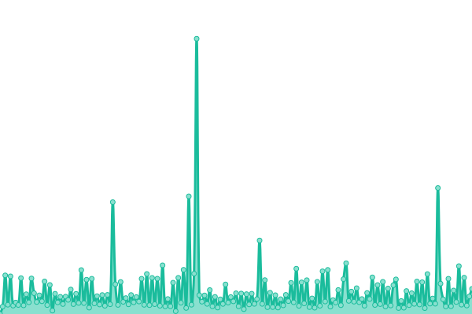

# [📈 Live Status](https://upptime.jianny.net): <!--live status--> **🟧 Partial outage**

<!--start: status pages-->
<!-- This summary is generated by Upptime (https://github.com/upptime/upptime) -->
<!-- Do not edit this manually, your changes will be overwritten -->
<!-- prettier-ignore -->
| URL | Status | History | Response Time | Uptime |
| --- | ------ | ------- | ------------- | ------ |
|  [Google](https://www.google.com) | 🟩 Up | [google.yml](https://github.com/jiannystein/upptime/commits/HEAD/history/google.yml) | 

 57ms
     
 | 

<a href="https://upptime.jianny.net/history/google">100.00%</a>
    

|  [Wikipedia](https://en.wikipedia.org) | 🟩 Up | [wikipedia.yml](https://github.com/jiannystein/upptime/commits/HEAD/history/wikipedia.yml) | 

 193ms
     
 | 

<a href="https://upptime.jianny.net/history/wikipedia">100.00%</a>
    

|  [Hacker News](https://news.ycombinator.com) | 🟩 Up | [hacker-news.yml](https://github.com/jiannystein/upptime/commits/HEAD/history/hacker-news.yml) | 

 445ms
     
 | 

<a href="https://upptime.jianny.net/history/hacker-news">100.00%</a>
    

|  [Facebook](https://www.facebook.com) | 🟩 Up | [facebook.yml](https://github.com/jiannystein/upptime/commits/HEAD/history/facebook.yml) | 

 183ms
     
 | 

<a href="https://upptime.jianny.net/history/facebook">100.00%</a>
    

|  [Whatsapp](https://wa.me/601152808880) | 🟩 Up | [whatsapp.yml](https://github.com/jiannystein/upptime/commits/HEAD/history/whatsapp.yml) | 

 591ms
     
 | 

<a href="https://upptime.jianny.net/history/whatsapp">100.00%</a>
    

|  [Azure](https://portal.azure.com) | 🟥 Down | [azure.yml](https://github.com/jiannystein/upptime/commits/HEAD/history/azure.yml) | 

 23ms
     
 | 

<a href="https://upptime.jianny.net/history/azure">9.13%</a>
    

|  [O365](https://outlook.office.com) | 🟩 Up | [o365.yml](https://github.com/jiannystein/upptime/commits/HEAD/history/o365.yml) | 

 551ms
     
 | 

<a href="https://upptime.jianny.net/history/o365">100.00%</a>
    

<!--end: status pages-->

[**Visit our status website →**](https://upptime.jianny.net)

## 📄 License

- Code: [MIT](./LICENSE) © [jiannystein](https://upptime.jianny.net)
- Data in the `./history` directory: [Open Database License](https://opendatacommons.org/licenses/odbl/1-0/)
